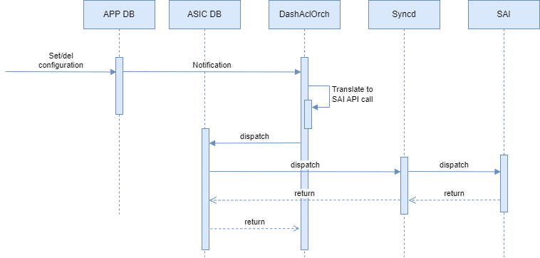

# DASH ACL Tags #

# Table of Content

- [DASH ACL Tags](#dash-acl-tags)
- [Table of Content](#table-of-content)
- [Revision](#revision)
- [Scope](#scope)
- [Definitions/Abbreviations](#definitionsabbreviations)
- [Overview](#overview)
- [Requirements](#requirements)
  - [Functional requirements](#functional-requirements)
  - [CLI requirements](#cli-requirements)
  - [Warm/fast boot requirements](#warmfast-boot-requirements)
  - [Scaling requirements](#scaling-requirements)
- [Architecture Design](#architecture-design)
- [High-Level Design](#high-level-design)
  - [APP DB Schema](#app-db-schema)
    - [DASH\_PREFIX\_TAG\_TABLE](#dash_prefix_tag_table)
    - [DASH\_ACL\_RULE\_TABLE](#dash_acl_rule_table)
  - [SWSS](#swss)
  - [DashAclOrch](#dashaclorch)
    - [Requirements](#requirements-1)
    - [Configuration flow](#configuration-flow)
    - [Detailed flow](#detailed-flow)
    - [Initialization](#initialization)
    - [Runtime](#runtime)
    - [Tags handling](#tags-handling)
    - [ACL rules handling](#acl-rules-handling)
- [SAI API](#sai-api)
  - [New SAI Entry](#new-sai-entry)
  - [New ACL Rule Attributes](#new-acl-rule-attributes)
  - [SWSS Translation](#swss-translation)
- [Configuration and management](#configuration-and-management)
  - [CLI/YANG model Enhancements](#cliyang-model-enhancements)
  - [Config DB Enhancements](#config-db-enhancements)
- [Warmboot and Fastboot Design Impact](#warmboot-and-fastboot-design-impact)
- [Restrictions/Limitations](#restrictionslimitations)
- [Testing Requirements/Design](#testing-requirementsdesign)
  - [Unit Test cases](#unit-test-cases)
  - [System Test cases](#system-test-cases)
- [Open/Action items - if any](#openaction-items---if-any)


# Revision

|  Rev  | Date  |       Author       | Change Description |
| :---: | :---: | :----------------: | ------------------ |
|  0.1  |       | Oleksandr Ivantsiv | Initial version    |

# Scope

# Definitions/Abbreviations

| **Term** | **Meaning**                        |
| -------- | ---------------------------------- |
| DASH     | Disaggregated APIs for SONiC Hosts |
| SAI      | Switch Abstraction Interface       |
| LPM      | Longest Prefix Match               |
| ACL      | Access Control List                |

# Overview

In a DASH SONiC, a service tag represents a group of IP address prefixes from a given service. The controller manages the address prefixes encompassed by the service tag and automatically updates the service tag as addresses change, minimizing the complexity of frequent updates to network security rules. Mapping a prefix to a tag can reduce the repetition of prefixes across different ACL rules and optimize memory usage

DPU pipeline may take advantage of IP prefix lists frequently used together by doing an additional lookup on tags.

# Requirements

## Functional requirements

- Tagging is implemented as a bitmap in Orchagent and SAI layers
- A prefix can belong to multiple tags
- Prefixes can be added or removed from a tag at any time
- The orchagent shall extend the tag map to include all subnets to allow an LPM-based lookup.
- SAI implementation shall return a capability for the bitmap size. A '0' return value shall be treated as no-tag support.
- The bitmap size depends on the SAI implementation capability. It is fixed during initialization based on the capability value returned by SAI implementation. This same bitmap size shall be later used for ACL rules and prefix-tag mapping. Orchagent shall implement the logic to chose the tags with largest number of prefixes, based on the capability value. Say 8 biggest tags in the above example. Rest of the tags shall be expanded to include prefixes in the ACL rules.

Full DASH ACL requirements are covered in [DASH SONiC HLD](https://github.com/sonic-net/DASH/blob/main/documentation/general/dash-sonic-hld.md).

## CLI requirements
No new CLI commands are required.

## Warm/fast boot requirements
Warm and fast reboots are not supported in the DASH SONiC

## Scaling requirements

| Item                    | Expected value |
| ----------------------- | -------------- |
| Total tags              | 4k*            |
| Max prefixes per tag    | 24k            |
| Max tags in an ACL rule | 4k             |

\* If vendor SAI doesn't support ACL tags or supports less than 4k tags SWSS will utilize the maximum supported HW tags. The remaining tags will be expanded to the prefixes list.

# Architecture Design

No SONiC architecture changes are required. The ACL tags feature is an extension of the existing ACL implementation.

# High-Level Design

Changes shall be made to sonic-swss and sonic-sairedis sub-modules to support this feature.

## APP DB Schema

The following are the schema changes.

### DASH_PREFIX_TAG_TABLE
A new `DASH_PREFIX_TAG_TABLE` table will be added to the APP DB schema.
```
DASH_PREFIX_TAG_TABLE:{{tag_name}}
    "ip_version": {{ipv4/ipv6}}
    "prefix_list": {{list of prefix}}
```

```
tag_name                  = STRING; unique tag name
ip_version                = IP version (IPv4/IPv6)
prefix_list               = list of ip prefixes ',' separated. It is valid to have empty list of prefixes.
                            If the prefix is empty, no packets will be assigned to this TAG.
```

### DASH_ACL_RULE_TABLE
The existing `DASH_ACL_RULE_TABLE` will be extended with a new `src_tag` and `dst_tag` optional attributes.
```
DASH_ACL_RULE_TABLE:{{group_id}}:{{rule_num}}
    "priority": {{priority}}
    "action": {{action}}
    "terminating": {{bool}}
    "protocol": {{list of protocols}} (OPTIONAL)
    "src_tag": {{list of tag name}} (OPTIONAL)
    "dst_tag": {{list of tag name}} (OPTIONAL)
    "src_addr": {{list of prefix}} (OPTIONAL)
    "dst_addr": {{list of prefix}} (OPTIONAL)
    "src_port": {{list of range of ports}} (OPTIONAL)
    "dst_port": {{list of range of ports}} (OPTIONAL)
```
```
key                      = DASH_ACL_RULE_TABLE:group_id:rule_num ; unique rule num within the group.
; field                  = value
priority                 = INT32 value  ; priority of the rule, lower the value, higher the priority
action                   = allow/deny
terminating              = true/false   ; if true, stop processing further rules
protocols                = list of INT ',' separated; E.g. 6-tcp, 17-udp; if not provided, match on all protocols
src_tag                  = list of source tag name ',' separated; if not provided, match on ANY tag or NO tag.
dst_tag                  = list of destination tag name ',' separated; if not provided, match on ANY tag or NO tag.
src_addr                 = list of source ip prefixes ',' separated; if not provided, match on all source IPs.
dst_addr                 = list of destination ip prefixes ',' separated; if not provided, match on all destination IPs.
src_port                 = list of range of source ports ',' separated;  if not provided, match on all source ports.
dst_port                 = list of range of destination ports ',' separated;  if not provided, match on all destination ports.
```

## SWSS

The following components of orchagent shall be modified.

## DashAclOrch

### Requirements

- Provide support for querying ACL tags capabilities from SAI once during the initialization. Based on the supported numbers of tags and prefixes that can be attached to one tag DashAclOrch shall decide if to create a HW tag or expand the tag to the list of prefixes.
- DashAclOrch is responsible for maintaining the number of available ACL tag resources.
- Provide support for adding new ACL tags with the list of prefixes in the DASH_PREFIX_TAG_TABLE APP DB table.
- Provide support for updating list of prefixes for ACL tags. ACL tag with no prefixes is a valid tag and means NO traffic can match it.
- Provide support for removing ACL tags. ACL tag can be removed only if it is not attached to any ACL rules.
- Provide support for multiple source and destination ACL tags for ACL rules in DASH_ACL_RULE_TABLE.
- Utilizing HW ACL tags or expanding to prefixes: DashAclOrch should prioritize the utilization of hardware ACL tags if available. In cases where hardware tags are not supported or resources are exhausted, ACL tags should be expanded to a list of prefixes to ensure consistent functionality.
    - If the number of tags exceeds SAI capabilities DashAclOrch should do expansion of the tag to the list of prefixes.
    - If SAI supports ACL tags:
        - SAI should allow adding new prefixes to or removing existing prefixes from the tag when it is attached to the rule.
        - If after adding a prefix to the ACL tag the total number of prefixes exceeds SAI capabilities DashAclOrch should for each rule that uses tag expand the tag to a list of prefixes.
    - If SAI doesn't support ACL tags DashAclOrch should update the list of prefixes for all ACL rules for which the tag was expanded to the list of prefixes.
- Expand tag prefixes to include all subnets to maintain LPM based lookup

### Configuration flow



### Detailed flow

DashAclOrch is responsible for DASH ACL support and should be extended to support ACL tags. DashAclOrch subscribes to DASH_PREFIX_TAG_TABLE and DASH_ACL_RULE_TABLE updates from APP_DB, processes the configuration updates, and transforms them into SAI API calls.

### Initialization

During the initialization, DashAclOrch will query and save the ACL tags capabilities. The capabilities will be used in the runtime to choose if to use HW ACL tag or prefixes expansion for the new entries.

### Runtime

When an update for the DASH_PREFIX_TAG_TABLE or DASH_ACL_RULE_TABLE table is received DashAclOrch will understand the operation type. The supported operation types are add, update, and remove.

### Tags handling

**LPM based lookup**

In order to enable LPM-based lookup for ACL tags, the DashAclOrch component needs to maintain a tree structure that stores all the prefixes configured across all ACL tags.

For each configured prefix of a specific ACL tag, DashAclOrch should perform a lookup operation to retrieve a list of all sub-prefixes associated with that prefix network from the maintained tree. All found sub-prefixes should be added to the tag.

For example. Given the following ACL tag configuration:
```
Tag1 - 10.1.1.0/24, 20.1.1.0/24
Tag2 - 10.1.2.0/24, 30.1.1.0/24
Tag3 - 10.0.0.0/8, 20.1.1.0/24, 50.1.1.1/32
```

The resulting ACL tags configuration will looks the following

```
Tag1 - 10.1.1.0/24, 20.1.1.0/24
Tag2 - 10.1.2.0/24, 30.1.1.0/24
Tag3 - 10.0.0.0/8, 10.1.1.0/24, 10.1.2.0/24, 20.1.1.0/24, 50.1.1.1/32
```

Tag1 and Tag2 prefixes don't have any sub-prefixes to include. However Tag3 has 10.0.0.0/8 prefix that has two sub-prefixes from Tag1 and Tag2.

**Add new ACL tag**

If the operation is to create a new ACL tag in DASH_PREFIX_TAG_TABLE DashAclOrch will do the following
- Store tags prefixes
- Postpone HW tag creation. Entry created in DASH_PREFIX_TAG_TABLE provides a mapping from the tag name to the list of prefixes. However, it is not yet known which HW tag entry (source, destination, or both) should be created. This will be known when ACL rules that reference that will be created.

**Tag allocation and initialization**

- If HW tag is available and the number of prefixes can fit into the tag
  - Allocate new HW tag
  - For each prefix:
      - Get list of all sub-prefixes
          - For each sub-prefix
            - Add the sub-prefix to the tag
- Else return an error

**Remove ACL tag**

If the operation is to remove the ACL tag from DASH_PREFIX_TAG_TABLE DashAclOrch will do the following
- If the tag is attached to the rules
    - Return an error
- If HW tag is used
    - For each prefix:
        - Remove the prefix from the tag
        - Update mapping from the prefix to tags

**Update ACL tag**

If the operation is to update the list of prefixes in the ACL tag in DASH_PREFIX_TAG_TABLE DashAclOrch will do the following
- If HW tag is used
    - For each removed prefix:
        - Remove the prefix from the tag
        - If the prefix is used as a sub-prefix by the other tags
          - For each tag
            - Remove sub-prefix from the tag
        - Update mapping from the prefix to tags
    - For each added prefix:
      - Add the prefix to the tag
      - Get list of all sub-prefixes
          - For each sub-prefix
            - Add the sub-prefix to the tag
      - Get list of all super-prefixes
      - For each tag that uses super-prefix
        - Add the prefix to the tag
      - Update mapping from the prefix to tags
- Else
    - Get list of ACL groups that use the tag
    - For each affected ACL group
    - If group is bound to the ENI
      - Create new ACL group
      - For each ACL rule of the original ACL group
        - Copy original ACL rule attributes
        - Update attributes if required
        - Create new ACL rule and attach it to the new ACL group
      - Bind ACL group to the ENI
      - Remove all old ACL rules
      - Remove old ACL group
    - Else (if ACL group is not bound)

### ACL rules handling


**ACL rules expansion**

The DashAclOrch should prioritize the usage of the HW tags. However, when the HW tags are not supported or HW tags resources are exhausted the DashAclOrch should fall back to the tags expansion to the list of prefixes.

There are two possible expansion approaches.
1. Full expansion
    If no HW ACL tags are supported by the SAI implementation the DashAclOrch should expand all configured tags to the list of prefixes. The DashAclOrch should combine all the prefixes from all the tags configured in the ACL rule for the same direction in the one super-set. The super-set shall be used to configure the prefix list attribute for the given direction.

    For example the following configuration:

    ```
    Tag1 - 10.1.1.0/24, 20.1.1.0/24
    Tag2 - 10.1.2.0/24, 30.1.1.0/24
    Tag3 - 10.0.0.0/8, 20.1.1.0/24, 50.1.1.1/32
    ```

    Rule:
    ```
    "src_tag": "Tag1,Tag2",
    "dst_tag": "Tag3"
    ```

    Shall be resolved into the following ACL rule:

    Rule:
    ```
    "src_addr": "10.1.1.0/24, 20.1.1.0/24, 10.1.2.0/24, 30.1.1.0/24",
    "dst_addr": "10.0.0.0/8, 20.1.1.0/24, 50.1.1.1/32"
    ```

2. Partial expansion
    If the SAI implementation supports HW ACL tags but there are no more HW ACL tags available the DashAclOrch shall fall back to the partial expansion of ACL tags. All tags for which HW tags can not be allocated shall be expanded to a superset of prefixes. The DashAclOrch should expand such configuration and create multiple ACL rules to cover all combinations of source tags, source prefixes, destination tags, and destination prefixes. This might require creation of up to 4 ACL rules. The rule shall be share the same common attributes.

    For example let's assume that there is no more resource for Tag2 and Tag4 for a given ACL rule:
    Rule:
    ```
    "src_tag": "Tag1, Tag2",
    "dst_tag": "Tag3, Tag4",
    ```

    Tag2 and Tag4 shall be expanded to a list of prefixes and ACL rule should be expanded to the following rules:

    Rule 1:
    ```
    "src_tag": "Tag1",
    "dst_tag": "Tag3,
    ```

    Rule 2:
    ```
    "src_tag": "<Tag2 prefixes>",
    "dst_addr": Tag3
    ```

    Rule 3:
    ```
    "src_tag": "Tag1",
    "dst_tag": "<Tag4 prefixes>,
    ```

    Rule 4:
    ```
    "src_tag": "<Tag2 prefixes>",
    "dst_addr": <Tag4 prefixes>
    ```

**ACL rule creation flow**

If the operation is to create a new ACL rule in DASH_ACL_RULE_TABLE DashAclOrch will do the following
- If tags are specified in the configuration
    - For each configured tag
        - Check if the tags exists in `DASH_PREFIX_TAG_TABLE`. If the tag doesn't return status "retry" to postpone rule creation.
        - Try to allocate and initialize the tag
    - If all tags are available
      - Create single SAI ACL rule with the given parameters.
    - Else
      - Create multiple SAI ACL rules according to ACL rules expansion algorithm
- Else
  - Create single SAI ACL rule with the given parameters.

**Remove ACL rule**

If the operation is to remove the existing ACL rule from DASH_ACL_RULE_TABLE DashAclOrch will do the following
- For each created SAI rule
    - Remove rule

**Update ACL rule**

- if the ACL group to which the ACL rule belongs is bound to the ENI
  - Return an error. It is not allowed to modify the ACL rules of the group bound to the ENI.
- Else
  - For each changed attribute
    - Update attribute configuration

# SAI API

**TODO**

## New SAI Entry

**TODO**

## New ACL Rule Attributes

**TODO**

## SWSS Translation

**TODO**

# Configuration and management

## CLI/YANG model Enhancements

No CLI/YANG enhancements required.

## Config DB Enhancements

No Config DB Enhancements required

# Warmboot and Fastboot Design Impact
DPU SONiC doesn't support warm/fast boot

# Restrictions/Limitations

# Testing Requirements/Design

## Unit Test cases
**TDB**

## System Test cases
**TDB**

# Open/Action items - if any
- DASH_PREFIX_TABLE scope. It the table global or should it be per ENI?